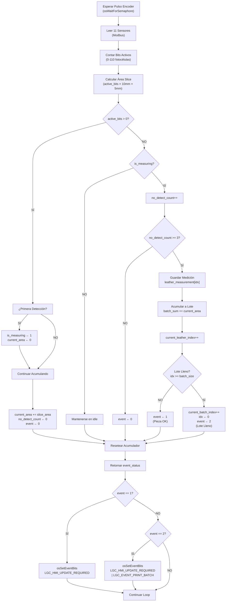

# Sistema de Medición de Cuero - Documentación de Arquitectura de Sistema

**Documento Técnico Senior** | Arquitectura Embebida STM32F4 + RTOS  
**Fecha:** 16 de Enero de 2026  
**Versión:** 1.0

---

## Tabla de Contenidos

1. [Resumen Ejecutivo](#resumen-ejecutivo)
2. [Arquitectura de Tareas (RTOS)](#arquitectura-de-tareas-rtos)
3. [Algoritmo de Medición de Cuero](#algoritmo-de-medición-de-cuero)
4. [Interfaz de Usuario (HMI)](#interfaz-de-usuario-hmi)
5. [Sistema de Eventos y Comunicación](#sistema-de-eventos-y-comunicación)
6. [Mapa de Hardware](#mapa-de-hardware)

---

## Resumen Ejecutivo

El sistema **Leather Gauge Controller** es un controlador embebido basado en **STM32F446RCTx** diseñado para medir automáticamente el área de piezas de cuero en movimiento continuo. El sistema utiliza:

- **11 fotoreceptores distribuidos** (sensores) para detectar cuero en 110 fotocélulas totales
- **Encoder rotatorio** para sincronización de muestreo de sensores
- **Algoritmo de integración de área** basado en "slices" (rebanadas) sucesivas
- **RTOS** para gestión de tareas concurrentes (selección configurable: µC/OS-III, ThreadX, FreeRTOS, etc.)
- **Interfaz Modbus** para comunicación con sensores remotos
- **Pantalla DWIN** para visualización de mediciones y estado del sistema
- **Impresora térmica ESC/POS** para generación de reportes

---

## Arquitectura de Tareas (RTOS)

El sistema implementa una arquitectura **multitarea preemptiva** con 3-4 tareas principales que colaboran mediante semáforos, mutexes y eventos de RTOS.

### 1. **Tarea Principal de Medición** (`lgc_main_task`)

#### Información Básica

| Propiedad           | Valor                                                          |
| ------------------- | -------------------------------------------------------------- |
| **Nombre**          | `main`                                                         |
| **Función Entrada** | `lgc_main_task_entry()`                                        |
| **Prioridad**       | `LGC_MAIN_TASK_PRI` (configurada en `lgc.c`, típicamente = 10) |
| **Stack Size**      | `LGC_MAIN_TASK_STACK` (configurada = 256 words)                |
| **Responsabilidad** | **Orquestador Principal y Motor de Medición**                  |

#### Descripción Detallada

Esta es la **tarea crítica** del sistema. Se encarga de:

1. **Sincronización con Encoder:** Espera el semáforo `encoder_flag` que se activa en cada pulso del encoder (GPIO EXTI Callback)
2. **Lectura de Sensores:** Lee los 11 sensores mediante interfaz **Modbus** en dirección de registro `0x2D` (45 en decimal)
3. **Procesamiento del Algoritmo de Medición:** Ejecuta la lógica de detección de cuero y cálculo de área
4. **Gestión de Lotes:** Mantiene contadores de piezas (`leather_count`) y lotes (`batch_count`)
5. **Máquina de Estados:** Implementa 3 estados del sistema: `LGC_STOP`, `LGC_RUNNING`, `LGC_FAIL`

#### Máquina de Estados de Control

```
┌─────────────────────────────────────────────────────────┐
│                    SISTEMA PRINCIPAL                     │
└─────────────────────────────────────────────────────────┘

                          ↓
                    ┌──────────────┐
                    │  LGC_STOP    │ (Estado Inicial)
                    └──────────────┘
                          ↑  ↓
                    (START FLAG)  (GUARD/MOTOR)
                          ↓  ↓
                    ┌──────────────┐
                    │  LGC_RUNNING │ (Midiendo)
                    └──────────────┘
                          ↓
                    (ENCODER PULSE → Medición)
                          ↓
                    ┌──────────────┐
                    │   LGC_FAIL   │ (Falla Detectada)
                    └──────────────┘
                          ↓
                    (GUARD RELEASED)
                          ↓
                       LGC_STOP
```

#### Sincronización y Semáforos

- **`encoder_flag` (OsSemaphore)**

  - **Inicializado:** `osCreateSemaphore(&encoder_flag, 0)` con count = 0
  - **Released por:** ISR del encoder (`lgc_encoder_callback()`) al ejecutar `osReleaseSemaphore(&encoder_flag)`
  - **Pend por:** `lgc_main_task_entry()` en línea 155: `if (osWaitForSemaphore(&encoder_flag, 50) == TRUE)`
  - **Timeout:** 50 ms (retorna si no hay pulso en 50 ms)
  - **Propósito:** Sincronizar la lectura de sensores con el movimiento del cuero

- **`mutex` (OsMutex)**
  - **Inicializado:** `osCreateMutex(&mutex)`
  - **Protege:** La estructura global `lgc_t data` que contiene estado y sensores
  - **Uso:** Evitar race conditions en acceso a `data` desde múltiples tareas
  - **Funciones que lo usan:**
    - `lgc_set_state()` - Actualizar estado
    - `lgc_buttons_callback()` - Procesar entrada de usuarios
    - `lgc_get_measurements()` - Copiar mediciones de forma segura
    - `lgc_get_state_data()` - Copiar datos de estado

### 2. **Tarea de Actualización de HMI** (`lgc_hmi_update_task`)

#### Información Básica

| Propiedad           | Valor                                                 |
| ------------------- | ----------------------------------------------------- |
| **Nombre**          | `hmi_update`                                          |
| **Función Entrada** | `lgc_hmi_update_task_entry()`                         |
| **Prioridad**       | `LGC_HMI_UPDATE_TASK_PRI` (configurada = 10)          |
| **Stack Size**      | `LGC_HMI_UPDATE_TASK_STACK` (configurada = 256 words) |
| **Responsabilidad** | **Renderizado de Interfaz de Usuario (DWIN)**         |

#### Descripción

- Espera evento `LGC_HMI_UPDATE_REQUIRED` (flag de evento)
- Captura snapshot seguro de mediciones usando `lgc_get_measurements()`
- Captura estado del sistema usando `lgc_get_state_data()`
- Actualiza la pantalla DWIN escribiendo en direcciones VP (Virtual Panels):
  - `LGC_HMI_VP_ICON_SPEEP` ← Indicador de velocidad motor
  - `LGC_HMI_VP_BATCH_COUNT` ← Índice de lote actual
  - `LGC_HMI_VP_LEATHER_COUNT` ← Conteo de piezas en lote
  - `LGC_HMI_VP_CURRENT_LEATHER_AREA` ← Área de pieza actual (×100 para resolución)

### 3. **Tarea de Procesamiento DWIN** (`dwin_process_task`)

#### Información Básica

| Propiedad           | Valor                                               |
| ------------------- | --------------------------------------------------- |
| **Nombre**          | `dwin_process`                                      |
| **Función Entrada** | `lgc_dwin_process_task_entry()`                     |
| **Prioridad**       | `DWIN_PROCESS_TASK_PRI` (configurada = 11)          |
| **Stack Size**      | `DWIN_PROCESS_TASK_STACK` (configurada = 256 words) |
| **Responsabilidad** | **Gestión de Comunicación DWIN (UART + Parsing)**   |

#### Descripción

- Maneja la comunicación UART con la pantalla DWIN
- Procesa callbacks de RX/TX completo (UART DMA)
- Decodifica mensajes del protocolo DWIN
- Dispara callbacks de eventos DWIN
- Usa `dwin_mutex` para proteger acceso concurrente

### 4. **Tarea de Procesamiento HMI** (`lgc_hmi_task`)

#### Información Básica

| Propiedad           | Valor                                             |
| ------------------- | ------------------------------------------------- |
| **Nombre**          | `hmi`                                             |
| **Función Entrada** | `lgc_hmi_task_entry()`                            |
| **Prioridad**       | `LGC_HMI_TASK_PRI` (configurada = 10)             |
| **Stack Size**      | `LGC_HMI_TASK_STACK` (configurada = 256 words)    |
| **Responsabilidad** | **Procesamiento de Eventos de Usuario (Botones)** |

#### Descripción

- Recibe mensajes desde cola `hmi_msg` (OsQueue)
- Procesa eventos de botones y controles de usuario
- Actualiza estado global basado en interacciones del usuario
- Actualmente con implementación mínima (placeholder para extensión)

### 5. **Tarea de Impresora** (`lgc_printer_task`)

#### Información Básica

| Propiedad           | Valor                                              |
| ------------------- | -------------------------------------------------- |
| **Nombre**          | `printer`                                          |
| **Función Entrada** | `lgc_printer_task_entry()`                         |
| **Prioridad**       | `LGC_PRINTER_TASK_PRI` (configurada = 10)          |
| **Stack Size**      | `LGC_PRINTER_TASK_STACK` (configurada = 128 words) |
| **Responsabilidad** | **Generación de Reportes Térmicos**                |

#### Descripción

- Espera evento `LGC_EVENT_PRINT_BATCH`
- Obtiene snapshot de mediciones actuales
- Formatea y envía datos a impresora térmica mediante protocolo **ESC/POS**
- Genera reportes con información de lote completado

---

## Algoritmo de Medición de Cuero

### Visión General del Algoritmo

El algoritmo implementa un **integrador de área basado en slices sucesivos** que calcula el área de cada pieza de cuero a medida que pasa a través del sistema.

### Componentes Hardware

#### Sensores y Fotoreceptores

- **Número de Sensores:** 11 (índices 0-10)
- **Fotoreceptores por Sensor:** 10 (bits 0-9 de cada lectura uint16_t)
- **Total de Fotocélulas:** 110
- **Ancho de Pixel:** 10.0 mm (configurable: `LGC_PIXEL_WIDTH_MM`)
- **Resolución del Encoder:** 5.0 mm por pulso (configurable: `LGC_ENCODER_STEP_MM`)

#### Interfaz de Lectura

- **Protocolo:** Modbus RTU (vía interfaz `lgc_interface_modbus_init()`)
- **Dirección de Registro:** 45 (0x2D) en cada sensor Modbus (slave ID 1-11)
- **Tipo de Dato:** uint16_t (16 bits, bits 0-9 usados para fotoreceptores)
- **Reintentos:** Hasta 4 intentos de lectura si falla (`LGC_SENSOR_READ_RETRY = 4`)
- **Delay entre Reintentos:** 20 ms

### Flujo del Algoritmo de Medición

#### **PASO 1: Lectura de Sensores (Síncrona con Encoder)**

Código: `lgc_main_task.c`, líneas 155-189

```c
// En cada pulso del encoder:
for (uint8_t i = 0; i < LGC_SENSOR_NUMBER; i++) {
    do {
        err = lgc_modbus_read_holding_regs(i + 1,          // Slave ID 1-11
                                            45,             // Address
                                            &data.sensor[i],// Store uint16_t
                                            1);             // 1 register
        if (err != NO_ERROR) {
            sensor_retry++;
            osDelayTask(20);
        }
    } while (sensor_retry <= LGC_SENSOR_READ_RETRY);
}
```

**Salida:** Arreglo `data.sensor[0..10]` con valores uint16_t de cada sensor

---

#### **PASO 2: Contar Bits Activos (Fotoreceptores Detectados)**

Código: `lgc_main_task.c`, líneas 287-305

```c
static uint16_t lgc_count_active_bits(void) {
    uint16_t active_bits = 0;

    // Iterar sobre los 11 sensores
    for (uint8_t i = 0; i < LGC_SENSOR_NUMBER; i++) {
        uint16_t sensor_data = data.sensor[i];

        // Contar bits activos en los primeros 10 bits
        for (uint8_t bit = 0; bit < LGC_PHOTORECEPTORS_PER_SENSOR; bit++) {
            if (sensor_data & (1 << bit)) {
                active_bits++;  // Incrementar si el bit está activo
            }
        }
    }

    return active_bits;  // Rango: 0-110
}
```

**Salida:** `active_bits` = Número de fotocélulas detectando cuero (0-110)

---

#### **PASO 3: Calcular Área del "Slice" (Rebanada)**

Código: `lgc_main_task.c`, líneas 307-317

```c
static float lgc_calculate_slice_area(uint16_t active_bits) {
    // Área = Ancho × Largo
    //      = (active_bits × pixel_width) × encoder_step
    float width = active_bits * LGC_PIXEL_WIDTH_MM;        // mm
    float area  = width * LGC_ENCODER_STEP_MM;              // mm²

    return area;
}

// Ejemplo numérico:
// Si active_bits = 50, pixel_width = 10 mm, encoder_step = 5 mm:
//   width = 50 × 10 = 500 mm
//   area  = 500 × 5 = 2500 mm²
```

**Salida:** `slice_area` en mm²

---

#### **PASO 4: Máquina de Estados de Detección de Cuero**

Código: `lgc_main_task.c`, líneas 319-485

Este es el **corazón del algoritmo**. Implementa una máquina de estados simple de 2 estados:

##### **4a) ESTADO: CUERO DETECTADO (`active_bits > 0`)**

```
┌─────────────────────────────────────────────────────────┐
│             CUERO DETECTADO (active_bits > 0)            │
└─────────────────────────────────────────────────────────┘

         ¿is_measuring == 0?
         (Primera vez detectado)
              ↓
         [TRANSICIÓN: Idle → Measuring]
         • is_measuring = 1
         • current_leather_area = 0.0
         • no_detection_count = 0
              ↓
    [ACCIÓN: Acumular Área]
    • current_leather_area += slice_area
    • no_detection_count = 0 (reset)
         ↓
     event_status = 0 (sin evento)
```

**Código:**

```c
if (active_bits > 0) {
    if (!measurements.is_measuring) {
        // Inicio de nueva pieza de cuero
        measurements.is_measuring = 1;
        measurements.current_leather_area = 0.0f;
        measurements.no_detection_count = 0;
    }

    // Acumular área
    measurements.current_leather_area += slice_area;
    measurements.no_detection_count = 0;

    event_status = 0;  // Sin evento
}
```

##### **4b) ESTADO: SIN CUERO DETECTADO (`active_bits == 0`)**

Cuando el cuero deja de ser detectado, se aplica **histéresis** para evitar falsos positivos:

```
┌─────────────────────────────────────────────────────────┐
│         SIN CUERO DETECTADO (active_bits == 0)          │
└─────────────────────────────────────────────────────────┘

      ¿is_measuring == 1?
    (Actualmente midiendo)
            ↓
    [HISTÉRESIS: no_detection_count++]
            ↓
    ¿no_detection_count >= LGC_LEATHER_END_HYSTERESIS?
    (Típicamente = 3 pulsos = 15 mm sin detección)
            ↓
        [EVENTO: FIN DE CUERO DETECTADO]

        1) Guardar medición individual:
           leather_measurement[current_leather_index] =
               current_leather_area

        2) Acumular a lote actual:
           batch_measurement[current_batch_index] +=
               current_leather_area

        3) Incrementar índice de piezas:
           current_leather_index++

        4) ¿Lote lleno?
           if (current_leather_index >= config->batch) {
               EVENTO: Lote completado
               current_batch_index++
               current_leather_index = 0
               event_status = 2
           }

        5) Reset para siguiente pieza:
           current_leather_area = 0.0

        event_status = 1  (Pieza completada)
```

**Parámetro de Configuración:**

- `LGC_LEATHER_END_HYSTERESIS = 3` (pasos sin detección para confirmar fin)
- A 5 mm/paso → 15 mm de tolerancia

---

#### **PASO 5: Gestión de Contadores y Eventos**

##### **Estructuras de Datos:**

```c
typedef struct {
    uint16_t current_batch_index;                    // [0..199]
    uint16_t current_leather_index;                  // [0..299] (dentro de lote)
    float current_leather_area;                      // Acumulador actual
    float leather_measurement[LGC_LEATHER_COUNT_MAX];// Array de 300
    float batch_measurement[LGC_LEATHER_BATCH_COUNT_MAX]; // Array de 200
    uint8_t is_measuring;                            // Flag: midiendo sí/no
    uint8_t no_detection_count;                      // Contador de histéresis
} lgc_measurements_t;
```

##### **Límites de Almacenamiento:**

- **Máximo de Piezas:** 300 (`LGC_LEATHER_COUNT_MAX`)
- **Máximo de Lotes:** 200 (`LGC_LEATHER_BATCH_COUNT_MAX`)
- **Típica:** 300 piezas ÷ 200 piezas/lote = 1.5 lotes máximo

##### **Códigos de Evento Retornados:**

| Código | Significado      | Acción Asociada                    |
| ------ | ---------------- | ---------------------------------- |
| 0      | Sin evento       | Continuar midiendo (o idle)        |
| 1      | Pieza completada | Actualizar HMI, guardar en EEPROM  |
| 2      | Lote completado  | Generar reporte, activar impresora |

---

### Diagrama de Flujo Completo



---

## Interfaz de Usuario (HMI)

### Arquitectura de Pantalla DWIN

#### Componentes

El sistema utiliza una pantalla **DWIN** (Disiree/Daning) conectada vía UART para visualizar mediciones e información del sistema.

#### Protocolo de Comunicación

- **Interface:** UART DWIN (protocolo propietario)
- **Baudrate:** 115200 bps (típico)
- **Tipo de Transferencia:** UART DMA con callbacks de RX/TX completo
- **Estructura:** Mensajes con dirección VP (Virtual Panel) y datos

#### Variables Virtuales (VP Address)

| VP Address                        | Parámetro      | Tipo | Descripción                                 |
| --------------------------------- | -------------- | ---- | ------------------------------------------- |
| `LGC_HMI_VP_ICON_SPEEP`           | Motor Speed    | u16  | Indicador de velocidad (0=lenta, 1=rápida)  |
| `LGC_HMI_VP_BATCH_COUNT`          | Lote Actual    | u16  | Índice de lote en progreso                  |
| `LGC_HMI_VP_LEATHER_COUNT`        | Piezas en Lote | u16  | Conteo de piezas dentro del lote actual     |
| `LGC_HMI_VP_CURRENT_LEATHER_AREA` | Área Actual    | u16  | Área de pieza actual (×100 para resolución) |

#### Estado Actual de Implementación

**Página HMI:** 1 (Página Principal)

```
┌─────────────────────────────────┐
│   LEATHER GAUGE CONTROLLER      │
├─────────────────────────────────┤
│  Speed:  [ICON_SPEED]           │
│  Batch:  [#] / 200              │  ← current_batch_index / max
│  Count:  [#] / 300              │  ← current_leather_index / max_per_batch
│  Area:   [####] mm²             │  ← current_leather_area × 100
├─────────────────────────────────┤
│  [START] [STOP] [CLEAR]         │
└─────────────────────────────────┘
```

#### Actualización de Pantalla

**Flujo de Actualización:**

1. **Evento:** `lgc_main_task` detecta cambio en mediciones
2. **Señal:** Ejecuta `osSetEventBits(&events, LGC_HMI_UPDATE_REQUIRED)`
3. **Recepción:** `lgc_hmi_update_task_entry()` despierta
4. **Captura Segura:** Obtiene snapshot de `measurements` con mutex
5. **Escritura DWIN:** Envía 4 escrituras VP:
   ```c
   dwin_write_vp_u16(&dwin_hmi, LGC_HMI_VP_ICON_SPEEP, state_data.speed_motor);
   dwin_write_vp_u16(&dwin_hmi, LGC_HMI_VP_BATCH_COUNT, measurements->current_batch_index);
   dwin_write_vp_u16(&dwin_hmi, LGC_HMI_VP_LEATHER_COUNT, measurements->current_leather_index);
   dwin_write_vp_u16(&dwin_hmi, LGC_HMI_VP_CURRENT_LEATHER_AREA, (uint16_t)(measurements->current_leather_area * 100));
   ```

#### Sincronización de Pantalla

- **UART DWIN:** Manejado por `dwin_process_task` con callbacks HAL
- **Mutex de Protección:** `dwin_mutex` protege acceso concurrente a estructura `dwin_hmi`
- **Semáforos:** `dwin_response`, `dwin_new_data_flag`, `tx_cplt_flag`

---

## Sistema de Eventos y Comunicación

### Mecanismo de Eventos Global

#### OsEvent (Flag Group)

```c
OsEvent events;  // Variable global en lgc.c
```

Inicialización: `osCreateEvent(&events)` en `lgc_system_init()`

#### Flags de Eventos Definidos

```c
typedef enum {
    LGC_EVENT_STOP              = 1 << 0,  // 0x001 - Detener sistema
    LGC_EVENT_START             = 1 << 2,  // 0x004 - Iniciar sistema
    LGC_FAILURE_DETECTED        = 1 << 3,  // 0x008 - Falla (guard/motor)
    LGC_FAILURE_CLEARED         = 1 << 4,  // 0x010 - Falla resuelta
    LGC_HMI_UPDATE_REQUIRED     = 1 << 5,  // 0x020 - Actualizar pantalla
    LGC_EVENT_PRINT_BATCH       = 1 << 6,  // 0x040 - Imprimir lote
} LGC_Events_t;
```

#### Tabla de Uso de Eventos

| Evento                    | Productor                                | Consumidor            | Propósito                 |
| ------------------------- | ---------------------------------------- | --------------------- | ------------------------- |
| `LGC_EVENT_START`         | `lgc_buttons_callback()`                 | `lgc_main_task`       | Transición STOP → RUNNING |
| `LGC_EVENT_STOP`          | `lgc_buttons_callback()`                 | `lgc_main_task`       | Transición RUNNING → STOP |
| `LGC_FAILURE_DETECTED`    | `lgc_buttons_callback()` (guard)         | `lgc_main_task`       | Transición → FAIL         |
| `LGC_FAILURE_CLEARED`     | `lgc_buttons_callback()` (guard release) | `lgc_main_task`       | Transición FAIL → STOP    |
| `LGC_HMI_UPDATE_REQUIRED` | `lgc_main_task` (evento medición)        | `lgc_hmi_update_task` | Refrescar pantalla        |
| `LGC_EVENT_PRINT_BATCH`   | `lgc_main_task` (evento lote lleno)      | `lgc_printer_task`    | Generar reporte           |

### Semáforos y Sincronización

#### Semáforo de Encoder

```c
static OsSemaphore encoder_flag;
```

- **Inicialización:** `osCreateSemaphore(&encoder_flag, 0)` (count inicial = 0)
- **Productor:** ISR de encoder (`lgc_encoder_callback()`)
  ```c
  static void lgc_encoder_callback(void) {
      osReleaseSemaphore(&encoder_flag);
  }
  ```
- **Consumidor:** `lgc_main_task_entry()`
  ```c
  if (osWaitForSemaphore(&encoder_flag, 50) == TRUE) {
      // Procesar medición
  }
  ```
- **Timeout:** 50 ms
- **Propósito:** Sincronizar lectura de sensores con movimiento del cuero

#### Mutex de Datos Globales

```c
static OsMutex mutex;
```

- **Inicialización:** `osCreateMutex(&mutex)` en `lgc_main_task_entry()`
- **Protección:** Estructura `lgc_t data` (sensor readings, state, flags)
- **Funciones que Adquieren:**
  1. `lgc_set_state()` - Actualizar estado
  2. `lgc_buttons_callback()` - Procesar entradas
  3. `lgc_get_state_data()` - Lectura segura de estado
  4. `lgc_get_measurements()` - Lectura segura de mediciones

**Patrón de Uso:**

```c
osAcquireMutex(&mutex);
// ... acceso a datos críticos ...
osReleaseMutex(&mutex);
```

### Interrupciones y Callbacks

#### ISR del Encoder

```c
void HAL_GPIO_EXTI_Callback(uint16_t GPIO_Pin) {
    if (lgc_module_encoder_callback != NULL) {
        lgc_module_encoder_callback();
    }
}
```

**Registro de Callback:** `lgc_module_encoder_init(lgc_encoder_callback)` (línea 118 en lgc_main_task.c)

**Acción:** Libera semáforo `encoder_flag` en contexto de ISR

#### ISR de Entrada de Usuario (Botones)

```c
void lgc_buttons_callback(uint8_t di, uint32_t evt);
```

Implementada en `lgc_main_task.c` (líneas 505-580)

**Botones Soportados:**

| Entrada             | Evento        | Acción                                               |
| ------------------- | ------------- | ---------------------------------------------------- |
| `LGC_DI_START_STOP` | Press         | Toggle `start_stop_flag`, set `LGC_EVENT_START/STOP` |
| `LGC_DI_GUARD`      | Press         | Set `guard_motor=1`, flag `LGC_FAILURE_DETECTED`     |
| `LGC_DI_GUARD`      | Release       | Set `guard_motor=0`, flag `LGC_FAILURE_CLEARED`      |
| `LGC_DI_SPEEDS`     | Press         | Set `speed_motor=1`, LED velocidad alta              |
| `LGC_DI_SPEEDS`     | Release       | Set `speed_motor=0`, LED velocidad baja              |
| `LGC_DI_FEEDBACK`   | Press/Release | Set `feedback_motor` (reservado)                     |

#### Callbacks UART (DWIN)

```c
static void lgc_dwin_uart_RxEventCallback(UART_HandleTypeDef *huart, uint16_t Pos);
static void lgc_dwin_uart_ErrorCallback(UART_HandleTypeDef *huart);
```

- Manejados por librería DWIN core (`dwin_core.c`)
- Disparan parsing de protocolo DWIN
- Activan `dwin_new_data_flag` semáforo

#### Callbacks UART (Modbus)

- Gestionados por stack Modbus (`nanomodbus`)
- Transparente para aplicación (manejado por interfaz Modbus)

---

## Mapa de Hardware

### Periféricos STM32F446RCTx

#### GPIO - Entradas/Salidas Digitales

```c
/* Salidas (DO) - Control de LEDs */
DO_0_GPIO_Port, DO_0_Pin       // LED Running (ON)
DO_1_GPIO_Port, DO_1_Pin       // LED Running (ON) - Doble para redundancia
D0_2_GPIO_Port, D0_2_Pin       // LED Running (OFF/Inverso)
D0_6_GPIO_Port, D0_6_Pin       // LED Speed Low
D0_7_GPIO_Port, D0_7_Pin       // LED Speed High

/* Entradas (DI) - Botones */
// Definidas en módulo input
LGC_DI_START_STOP              // GPIO de botón START/STOP
LGC_DI_GUARD                   // GPIO de botón Guard (protección motor)
LGC_DI_SPEEDS                  // GPIO de botón Velocidad
LGC_DI_FEEDBACK                // GPIO de botón Feedback
```

#### UART

```c
/* UART DWIN */
usart_dwin                     // UART para pantalla DWIN (115200 bps)

/* UART Modbus */
usart_modbus                   // UART para sensores Modbus (115200 bps típico)
```

#### Timer / Encoder

```c
/* GPIO EXTI - Encoder */
TIM_ENCODER_Pin                // Pin de entrada para pulsos del encoder
EXTI_Interrupt                 // Configurado como GPIO EXTI para cada pulso
```

#### Otros Periféricos

```c
/* I2C */
i2c_eeprom                     // I2C para almacenamiento de configuración
                               // (módulo lgc_module_eeprom)

/* USB OTG */
usb_otg                        // USB (posiblemente para debug/programming)
```

### Sensores Externos (Modbus)

```
┌─────────────────┐         Modbus RTU           ┌──────────────┐
│  STM32F446RCTx  │ ◄──────────────────────────► │  Sensor Mod. │
│  (Master)       │                              │  1-11        │
└─────────────────┘                              └──────────────┘
                                 ▲
                                 │
                        Líneas RS-485
                    (A, B, GND, típico)
```

- **Sensores Modbus:** 11 unidades (ID 1-11)
- **Registro de Lectura:** Address 45 (0x2D) en cada sensor
- **Datos:** uint16_t con fotoreceptores en bits 0-9

### Pantalla DWIN

```
┌─────────────────┐         UART 115200         ┌──────────────┐
│  STM32F446RCTx  │ ◄──────────────────────────► │   DWIN       │
│  (Host)         │      (5V logic converted)   │   Display    │
└─────────────────┘                              └──────────────┘
                                                   (7" típica)
```

### Impresora Térmica

```
┌─────────────────┐         UART 115200         ┌──────────────┐
│  STM32F446RCTx  │ ◄──────────────────────────► │   Thermal    │
│  (Host)         │      ESC/POS Protocol      │   Printer    │
└─────────────────┘                              │   80mm       │
                                                 └──────────────┘
```

---

## Configuración y Definiciones Importantes

### Configuración de Tareas

```c
// lgc.c
#define LGC_MAIN_TASK_STACK      256    // words
#define LGC_MAIN_TASK_PRI        10     // priority

// lgc_hmi_task.c
#define DWIN_PROCESS_TASK_PRI    11
#define DWIN_PROCESS_TASK_STACK  256
#define LGC_HMI_TASK_PRI         10
#define LGC_HMI_TASK_STACK       256
#define LGC_HMI_UPDATE_TASK_PRI  10
#define LGC_HMI_UPDATE_TASK_STACK 256

// lgc_printer_task.c
#define LGC_PRINTER_TASK_STACK   128
#define LGC_PRINTER_TASK_PRI     10
```

### Configuración de Medición

```c
// lgc_typedefs.h
#define LGC_SENSOR_NUMBER              11
#define LGC_LEATHER_COUNT_MAX          300
#define LGC_LEATHER_BATCH_COUNT_MAX    200

// lgc_main_task.c
#define LGC_SENSOR_READ_RETRY          4
#define LGC_PIXEL_WIDTH_MM             10.0f
#define LGC_ENCODER_STEP_MM            5.0f
#define LGC_PHOTORECEPTORS_PER_SENSOR  10
#define LGC_LEATHER_END_HYSTERESIS     3   // pasos sin detección
```

### Configuración HMI

```c
// lgc_hmi_task.c
#define DWIN_BUFFER_SIZE               1024
```

---

## Flujos de Ejecución Críticos

### Flujo 1: Iniciación del Sistema

```
main() / app_threadx_init()
    ↓
osInitKernel()
    ↓
lgc_system_init(memory)
    ├─ osPoolInit(memory)                  // Pool de memoria
    ├─ lgc_hmi_init()                       // Iniciar HMI/DWIN
    ├─ lgc_printer_init()                   // Crear tarea impresora
    ├─ osCreateEvent(&events)               // Flag group global
    ├─ lgc_interface_modbus_init()          // Iniciar Modbus
    ├─ lgc_module_input_init(callback)      // Iniciar botones
    ├─ lgc_module_eeprom_init()             // Iniciar EEPROM
    └─ osCreateTask("main", lgc_main_task_entry, ...)  // Tarea principal
        ├─ osCreateSemaphore(&encoder_flag, 0)
        ├─ osCreateMutex(&mutex)
        └─ lgc_module_encoder_init(callback)
    ↓
osStartKernel()
    ↓
[Planificador RTOS inicia todas las tareas]
```

### Flujo 2: Pulso del Encoder → Medición

```
HAL_GPIO_EXTI_Callback(pin)
    ↓
lgc_encoder_callback()
    ↓
osReleaseSemaphore(&encoder_flag)
    ↓
[lgc_main_task despierta]
    ↓
Leer 11 sensores vía Modbus (con reintentos)
    ↓
lgc_count_active_bits() → 0-110
    ↓
lgc_calculate_slice_area() → mm²
    ↓
lgc_process_measurement()
    ├─ Máquina de estados
    └─ Retorna: 0, 1, ó 2
    ↓
if (event_status == 1)
    ↓
osSetEventBits(&events, LGC_HMI_UPDATE_REQUIRED)
    ↓
[lgc_hmi_update_task despierta]
    ↓
Actualizar pantalla DWIN
```

### Flujo 3: Lote Completado → Impresión

```
lgc_process_measurement()
    ↓
[Pieza #300 completada]
    ↓
measurements.current_leather_index >= config->batch
    ↓
event_status = 2 (Lote Lleno)
    ↓
osSetEventBits(&events, LGC_HMI_UPDATE_REQUIRED | LGC_EVENT_PRINT_BATCH)
    ↓
[lgc_hmi_update_task despierta]
    ├─ Actualizar pantalla
    └─ lgc_hmi_update_task_entry() retorna
        ↓
[lgc_printer_task despierta]
    ↓
Obtener snapshot de mediciones
    ↓
Formatear reporte con ESC_POS_Printer
    ↓
Enviar a impresora térmica
    ↓
Esperar siguiente evento de lote
```

### Flujo 4: Control de Estado (START/STOP)

```
Usuario presiona botón START
    ↓
HAL_GPIO_Exti_Callback(pin)
    ↓
lgc_buttons_callback(LGC_DI_START_STOP, LWBTN_EVT_ONPRESS)
    ↓
osAcquireMutex(&mutex)
data.start_stop_flag ^= 1  // Toggle
osReleaseMutex(&mutex)
    ↓
osSetEventBits(&events, LGC_EVENT_START)
    ↓
[lgc_main_task case LGC_STOP despierta]
    ↓
¿osWaitForEventBits(..., LGC_EVENT_START)?
    ↓
data.start_stop_flag == 1?  ✓
    ↓
lgc_set_state(LGC_RUNNING)
    ↓
lgc_set_leds(LGC_RUNNING_LED, 1)  // Encender LED
    ↓
osSetEventBits(&events, LGC_HMI_UPDATE_REQUIRED)
    ↓
[Ahora en estado RUNNING, esperando encoder_flag]
```

---

## Apéndice: Estructura de Datos Completa

### lgc_t (Estado Principal)

```c
typedef struct {
    uint8_t state;              // 0=STOP, 1=RUNNING, 2=FAIL
    uint16_t sensor_status;     // Bitmask: 0=OK, 1=Error para cada sensor
    uint16_t sensor[11];        // Datos de sensores (bits 0-9: fotocélulas)
    uint8_t start_stop_flag;    // Flag de START/STOP
    uint8_t guard_motor;        // Flag de protección motor
    uint8_t speed_motor;        // Flag de velocidad
    uint8_t feedback_motor;     // Flag de realimentación
} lgc_t;
```

### lgc_measurements_t (Mediciones)

```c
typedef struct {
    uint16_t current_batch_index;                    // [0..199]
    uint16_t current_leather_index;                  // [0..299]
    float current_leather_area;                      // Acumulador actual
    float leather_measurement[300];                  // Historial de piezas
    float batch_measurement[200];                    // Historial de lotes
    uint8_t is_measuring;                            // En proceso de medición
    uint8_t no_detection_count;                      // Contador de histéresis
} lgc_measurements_t;
```

### dwin_t (Estado DWIN)

Gestiona protocolo DWIN y estado de comunicación (estructura en `dwin_core.h`)

---

## Conclusiones y Observaciones

### Puntos Clave de Arquitectura

1. **Sincronización Robusta:** El uso de semáforos y eventos garantiza sincronización precisa entre encoder y lectura de sensores.

2. **Algoritmo de Integración:** El modelo de "slices" permite medición continua y acumulativa del área sin necesidad de almacenar datos intermedios.

3. **Histéresis de Detección:** El parámetro `LGC_LEATHER_END_HYSTERESIS=3` proporciona filtrado de ruido sin agregar latencia significativa (15 mm tolerancia).

4. **Escalabilidad:** La arquitectura soporta hasta 300 piezas y 200 lotes sin limitación de hardware (solo almacenamiento).

5. **Protección de Datos:** Mutex en estructuras compartidas previene race conditions y corrupción de datos.

6. **Extensibilidad:** La tarea de HMI está diseñada para soportar múltiples páginas y widgets sin cambios arquitectónicos.

### Recomendaciones de Mejora

- [ ] Agregar almacenamiento en EEPROM de mediciones completadas
- [ ] Implementar estadísticas en tiempo real (promedio, máximo, mínimo)
- [ ] Agregar filtro digital para ruido de sensores
- [ ] Implementar calibración automática de sensores
- [ ] Agregar comunicación Ethernet para reportes remotos

---

**Documento Generado Automáticamente** | Arquitectura Técnica Documentada  
**Especialista:** Technical Documentation Senior | Sistemas Embebidos STM32/RTOS
