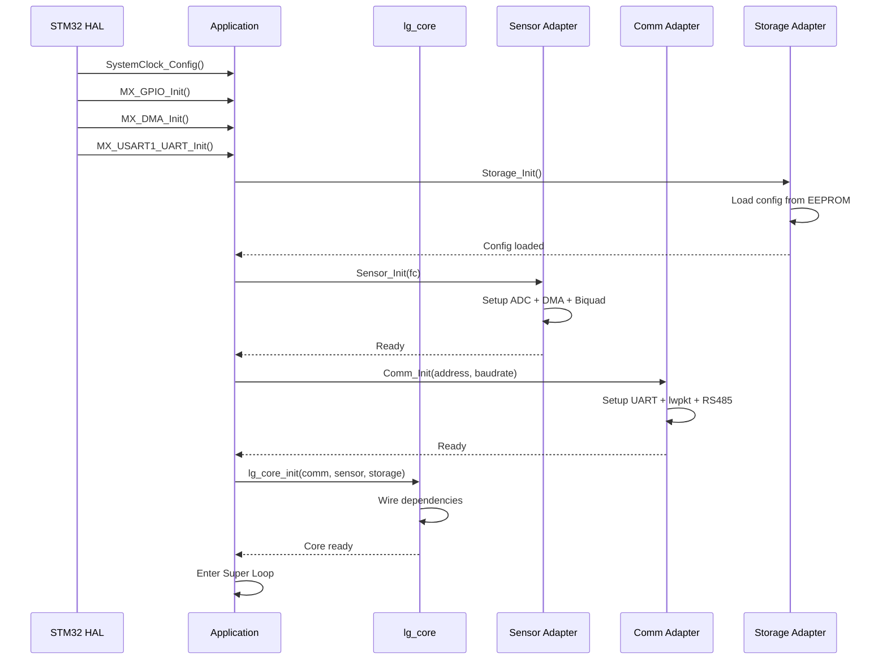
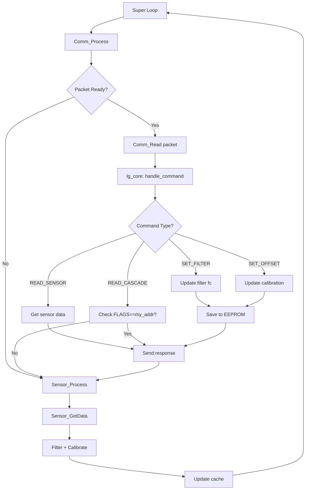
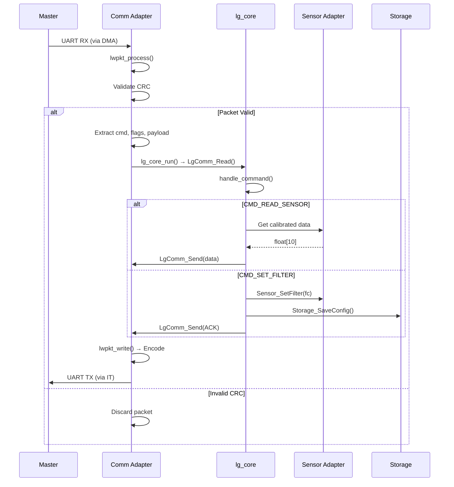
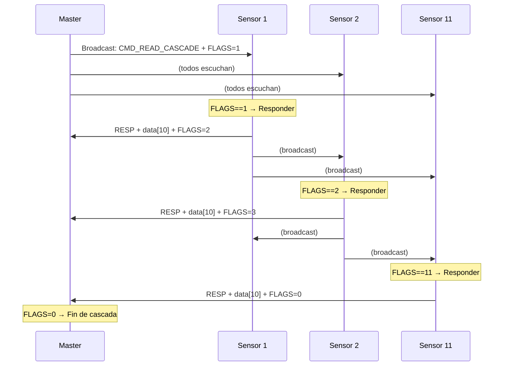

# 📏 Leather Gauge Sensor V2 - Firmware

**Firmware embebido de alta precisión para medición de espesor de cuero mediante sensores analógicos con filtrado digital y comunicación RS-485.**


---

## 📋 Tabla de Contenidos

- [Descripción General](#-descripción-general)
- [Arquitectura del Sistema](#-arquitectura-del-sistema)
- [Protocolo de Comunicación](#-protocolo-de-comunicación)
- [Flujo de Operación](#-flujo-de-operación)
- [Compilación e Instalación](#-compilación-e-instalación)
- [Configuración](#-configuración)
- [API y Comandos](#-api-y-comandos)
- [Desarrollo](#-desarrollo)
- [Referencias](#-referencias)

---

## 🎯 Descripción General

### Hardware

- **Microcontrolador:** STM32G030C8TX (Cortex-M0+, 64KB Flash, 8KB RAM)
- **Sensores:** 10 canales ADC analógicos (12-bit) para medición de espesor
- **Comunicación:** RS-485 half-duplex (115200 baud, 8N1)
- **Almacenamiento:** EEPROM I²C para configuración persistente
- **Interfaz:** DE/RE pin para control automático del transceptor RS-485

### Características Principales

✅ **Filtrado Digital Avanzado:**

- Biquad IIR filter (configurable cutoff frequency)
- Reduce ruido de sensores analógicos
- Mejora precisión de mediciones

✅ **Comunicación Optimizada:**

- Protocolo LwPKT (Lightweight Packet Protocol)
- CRC-8 para integridad de datos
- Modo Individual (1 comando → 1 respuesta)
- Modo Cascada (1 broadcast → 11 respuestas secuenciales, **67% más rápido**)

✅ **Arquitectura Limpia:**

- Clean Architecture (Core, Adapters, Application)
- Principios SOLID (DIP 100%, SRP 95%)
- Código testeable en PC (sin hardware)
- Zero dynamic allocation (embedded-safe)

---

## 🏗️ Arquitectura del Sistema

### Capas de Abstracción

```
┌─────────────────────────────────────────────────────────────┐
│                    APPLICATION LAYER                         │
│                  (leather_gauge_sensor/app)                  │
│  - Composition Root: Inicialización y wiring                 │
│  - Super Loop: Poll comms, process commands, update sensors  │
└──────────────────────┬──────────────────────────────────────┘
                       │ Dependency Injection
┌──────────────────────▼──────────────────────────────────────┐
│                      DOMAIN LAYER (CORE)                     │
│                  (leather_gauge_sensor/core)                 │
│  - lg_core.c: Command handlers, business logic               │
│  - lg_domain_types.h: Entities (SensorData, Config, Packet) │
└──────────────────────┬──────────────────────────────────────┘
                       │ Interfaces (Ports)
┌──────────────────────▼──────────────────────────────────────┐
│                    INTERFACE LAYER                           │
│                (leather_gauge_sensor/interfaces)             │
│  - lg_i_comm.h: Communication abstraction                    │
│  - lg_i_sensor.h: Sensor abstraction                         │
│  - lg_i_storage.h: Storage abstraction                       │
│  - lg_i_lwpkt.h: Codec abstraction (DIP enforcement)         │
└──────────────────────┬──────────────────────────────────────┘
                       │ Implementations
┌──────────────────────▼──────────────────────────────────────┐
│                 INFRASTRUCTURE LAYER (ADAPTERS)              │
│                (leather_gauge_sensor/adapters)               │
│  ┌─────────────────┬─────────────────┬────────────────────┐ │
│  │ sensor_stm32/   │ comms_lwpkt/    │ storage_eeprom/    │ │
│  │ - ADC + DMA     │ - LwPKT v1.5.1  │ - I²C EEPROM       │ │
│  │ - Biquad Filter │ - UART + RS485  │ - Config persist   │ │
│  │ - Threshold det │ - DMA RX/TX     │                    │ │
│  └─────────────────┴─────────────────┴────────────────────┘ │
└─────────────────────────────────────────────────────────────┘
                       │
┌──────────────────────▼──────────────────────────────────────┐
│                    HARDWARE LAYER                            │
│       - STM32 HAL (ADC, UART, DMA, GPIO, I²C, EEPROM)       │
│       - Third Party (lwpkt, lwrb, DSP_Biquad)               │
└─────────────────────────────────────────────────────────────┘
```

### Regla de Dependencia

**Todas las dependencias apuntan HACIA ADENTRO:**

- Core NO conoce Adapters ni HAL
- Adapters implementan interfaces definidas por Core
- Solo Adapters pueden incluir `stm32g0xx_hal.h`

---

## 📡 Protocolo de Comunicación

### LwPKT (Lightweight Packet Protocol)

#### Estructura del Frame

```
┌────┬──────┬────┬───────┬─────┬─────────┬─────┐
│ SOF│ ADDR │CMD │ FLAGS │ LEN │ PAYLOAD │ CRC │
├────┼──────┼────┼───────┼─────┼─────────┼─────┤
│ 1B │  1B  │ 1B │  4B   │ 1B  │ 0-255B  │ 1B  │
└────┴──────┴────┴───────┴─────┴─────────┴─────┘

SOF    = Start of Frame (0x01)
ADDR   = Destination address (1-11 sensor, 0xFF broadcast)
CMD    = Command ID (see command table)
FLAGS  = Control field (used for cascade reads)
LEN    = Payload length
PAYLOAD= Command data
CRC    = CRC-8 checksum
```

#### Mapa de Comandos

| Comando          | Código | FLAGS | Payload      | Respuesta    | Descripción                              |
| ---------------- | ------ | ----- | ------------ | ------------ | ---------------------------------------- |
| **READ_SENSOR**  | 0x10   | 0     | -            | float[10]    | Lee valores calibrados (modo individual) |
| **READ_RAW**     | 0x11   | 0     | -            | uint16_t[10] | Lee valores ADC raw                      |
| **READ_CASCADE** | 0x12   | 1-11  | -            | float[10]    | Lee en cascada (broadcast optimizado)    |
| **SET_OFFSET**   | 0x21   | 0     | float[10]    | ACK          | Configura offset de calibración          |
| **SET_FILTER**   | 0x22   | 0     | float fc     | ACK          | Configura frecuencia de corte del filtro |
| **GET_STATUS**   | 0x31   | 0     | -            | uint16_t     | Lee estado digital (threshold)           |
| **ERROR**        | 0xFF   | 0     | uint8_t code | -            | Respuesta de error                       |

#### Códigos de Error

```c
typedef enum {
    LG_OK = 0,           // Success
    LG_ERROR,            // Generic error
    LG_BUSY,             // Resource busy
    LG_TIMEOUT,          // Operation timeout
    LG_INVALID_PARAM     // Invalid parameter
} lg_result_t;
```

### Modos de Lectura

#### 🐢 Modo Individual (Tradicional)

**Latencia:** ~1.5-2 segundos para 11 sensores

```python
# Python Master
for sensor_addr in range(1, 12):
    send_to(sensor_addr, CMD_READ_SENSOR)
    response = wait_response(timeout=200)  # 200ms por sensor
    data = parse(response.payload)
    store(sensor_addr, data)

# Total: 11 × 150ms ≈ 1.65s
```

**Secuencia:**

```
Master → Sensor1: CMD_READ_SENSOR
Sensor1 → Master: RESP + data[10]
Master → Sensor2: CMD_READ_SENSOR
Sensor2 → Master: RESP + data[10]
...
Master → Sensor11: CMD_READ_SENSOR
Sensor11 → Master: RESP + data[10]
```

#### ⚡ Modo Cascada (Optimizado con FLAGS)

**Latencia:** ~500-550ms para 11 sensores (**67% más rápido**)

```python
# Python Master (Optimizado)
send_broadcast(addr=0xFF, cmd=CMD_READ_CASCADE, flags=1)  # Inicia en Sensor 1

for i in range(1, 12):
    response = wait_response(timeout=100)  # 100ms por sensor
    if response:
        data = parse(response.payload)
        next_sensor = response.flags  # Siguiente sensor a responder
        store(i, data)
    else:
        log_error(f"Sensor {i} timeout")
        break

# Total: 11 × 50ms ≈ 550ms
```

**Secuencia:**

```
Master → Broadcast: CMD_READ_CASCADE + FLAGS=1
  ↓ Todos escuchan
Sensor1 → Master: RESP + data[10] + FLAGS=2  (solo responde si FLAGS==1)
  ↓ Todos escuchan
Sensor2 → Master: RESP + data[10] + FLAGS=3  (solo responde si FLAGS==2)
  ↓ Todos escuchan
Sensor3 → Master: RESP + data[10] + FLAGS=4
...
Sensor11 → Master: RESP + data[10] + FLAGS=0  (FLAGS=0 termina cascada)
```

**Lógica del Sensor:**

```c
// En lg_core.c
case CMD_READ_CASCADE:
{
    if (ctx.rx_packet.flags == ctx.config.address) {
        // Es mi turno, responder
        memcpy(response_data, ctx.current_data.calibrated, sizeof(...));
        response_flags = ctx.config.address + 1;  // Siguiente sensor
        if (response_flags > 11) response_flags = 0;  // Fin

        LgComm_SendWithFlags(ctx.comm, CMD_READ_CASCADE_RESP,
                              response_flags, response_data, len);
    } else {
        // No es mi turno, ignorar
        return;
    }
    break;
}
```

**Ventajas:**

- ✅ 1 comando vs 11 comandos
- ✅ Menos overhead de protocolo
- ✅ Sin colisiones (control secuencial con FLAGS)
- ✅ Tolerante a fallos (timeout individual por sensor)

---

## 🔄 Flujo de Operación

### Inicialización (Power-On)



### Super Loop (Runtime)



### Procesamiento de Comando (Detail)



### Lectura Cascada (Broadcast con FLAGS)



---

## 🔨 Compilación e Instalación

### Requisitos

- **Toolchain:** GNU Arm Embedded Toolchain 13.3.rel1 o superior
- **Build Tool:** Make (GNU Make 4.x)
- **IDE (opcional):** STM32CubeIDE 1.15+
- **Flash Tool:** OpenOCD, STM32CubeProgrammer, o SWD/JTAG

### Compilar Firmware

```bash
# Limpiar build anterior
make -C Debug clean

# Compilar (genera .elf, .bin, .hex, .list, .map)
make -C Debug all

# Ver tamaño del binario
arm-none-eabi-size Debug/leather_gauge_sensor_v2.elf
```

**Salida esperada:**

```
   text    data     bss     dec     hex filename
  45678    1024    2048   48750    be6e Debug/leather_gauge_sensor_v2.elf
```

### Flashear a Microcontrolador

#### Opción 1: STM32CubeProgrammer (GUI)

1. Conectar ST-Link v2/v3 al target
2. Abrir STM32CubeProgrammer
3. Conectar (SWD, 4MHz)
4. Cargar archivo: `Debug/leather_gauge_sensor_v2.elf`
5. Start Programming

#### Opción 2: OpenOCD (CLI)

```bash
openocd -f interface/stlink.cfg \
        -f target/stm32g0x.cfg \
        -c "program Debug/leather_gauge_sensor_v2.elf verify reset exit"
```

#### Opción 3: STM32CubeIDE (Debug)

1. Click derecho en proyecto → Debug As → STM32 C/C++ Application
2. Configurar SWD debugger
3. Launch (automáticamente flashea y debuggea)

---

## ⚙️ Configuración

### Parámetros de Hardware

Archivo: `leather_gauge_sensor/config/leather_gauge_config.h`

```c
#define LG_DEFAULT_ADDRESS    1        // Device address (1-11)
#define LG_BAUDRATE          115200    // RS-485 baud rate
#define LG_FILTER_FC         10.0f     // Biquad filter cutoff (Hz)
#define LG_THRESHOLD         2048      // Digital threshold (12-bit ADC)
#define LG_NUM_CHANNELS      10        // Number of ADC channels
```

### Configuración LwPKT

Archivo: `Third_Party/lwpkt/src/include/lwpkt/lwpkt_opt.h`

```c
#define LWPKT_CFG_USE_ADDR       LWPKT_ON_STATIC  // Address field enabled
#define LWPKT_CFG_USE_CMD        LWPKT_ON_STATIC  // Command field enabled
#define LWPKT_CFG_USE_FLAGS      LWPKT_ON_STATIC  // FLAGS enabled (cascade)
#define LWPKT_CFG_USE_CRC        LWPKT_ON_STATIC  // CRC-8 validation
#define LWPKT_CFG_CRC32          LWPKT_OFF        // Use CRC-8 (not CRC-32)
```

### Configuración de Dirección (Runtime)

```c
// En Application Layer (leather_gauge.c)
lg_config_t config = {
    .address = 1,        // Sensor ID (1-11)
    .baudrate = 115200,
    .fc = 10.0f,
    .threshold = 2048,
    .offset = {0}        // Calibration offsets
};
```

### Cambiar Dirección por Software

```python
# Python Master
send_to(old_addr, CMD_SET_CONFIG, payload={
    'address': new_addr,
    'baudrate': 115200,
    'fc': 10.0,
    'threshold': 2048
})
```

---

## 📚 API y Comandos

### Interfaz de Comunicación (`lg_i_comm.h`)

```c
// Inicializar comunicación
lg_result_t LgComm_Init(const lg_i_comm_t *iface,
                         uint8_t address, uint32_t baudrate);

// Procesar eventos (llamar en super loop)
lg_result_t LgComm_Process(const lg_i_comm_t *iface);

// Leer paquete recibido (non-blocking)
lg_result_t LgComm_Read(const lg_i_comm_t *iface,
                         lg_comm_packet_t *packet);

// Enviar respuesta (modo individual)
lg_result_t LgComm_Send(const lg_i_comm_t *iface,
                         uint8_t cmd, const void *data, uint16_t len);

// Enviar con FLAGS (modo cascada)
lg_result_t LgComm_SendWithFlags(const lg_i_comm_t *iface,
                                  uint8_t cmd, uint32_t flags,
                                  const void *data, uint16_t len);

// Cambiar dirección
lg_result_t LgComm_SetAddress(const lg_i_comm_t *iface, uint8_t address);
```

### Interfaz de Sensor (`lg_i_sensor.h`)

```c
// Inicializar sensor con filtro
lg_result_t (*init)(float fc);

// Procesar ADC (llamar en super loop)
lg_result_t (*process)(void);

// Obtener datos procesados
lg_result_t (*get_data)(lg_sensor_data_t *data);

// Actualizar filtro
lg_result_t (*set_filter)(float fc);
```

### Tipos de Datos del Dominio

```c
// Paquete de comunicación
typedef struct {
    uint8_t cmd;         // Command ID
    uint8_t data[256];   // Payload
    uint16_t len;        // Payload length
    uint32_t from_addr;  // Sender address
    uint32_t flags;      // FLAGS field (cascade control)
} lg_comm_packet_t;

// Datos del sensor
typedef struct {
    uint16_t raw[10];        // Raw ADC values (12-bit)
    float filtered[10];      // Filtered values
    float calibrated[10];    // Calibrated (filtered + offset)
    uint16_t digital_state;  // Threshold bitmask
} lg_sensor_data_t;

// Configuración
typedef struct {
    uint8_t address;     // Device address (1-11)
    uint32_t baudrate;   // UART baudrate
    float fc;            // Filter cutoff frequency
    uint16_t threshold;  // Digital threshold
    float offset[10];    // Calibration offsets
} lg_config_t;
```

---

## 🧪 Desarrollo

### Estructura del Proyecto

```
leather_gauge_sensor_v2/
├── Core/                           # STM32 HAL (CubeMX generated)
│   ├── Inc/
│   └── Src/
├── Drivers/                        # CMSIS + HAL Drivers
├── Third_Party/                    # External libraries
│   ├── lwpkt/                      # Packet protocol
│   ├── lwrb/                       # Ring buffer
│   └── DSP_Biquad/                 # Digital filter
├── leather_gauge_sensor/           # Application code
│   ├── app/                        # Composition root
│   ├── core/                       # Domain logic
│   │   ├── lg_core.c              # Command handlers
│   │   └── lg_domain_types.h      # Entities
│   ├── interfaces/                 # Port definitions
│   │   ├── lg_i_comm.h            # Communication interface
│   │   ├── lg_i_sensor.h          # Sensor interface
│   │   ├── lg_i_storage.h         # Storage interface
│   │   └── lg_i_lwpkt.h           # Codec interface
│   ├── adapters/                   # Infrastructure
│   │   ├── comms_lwpkt/           # UART + RS485 + LwPKT
│   │   ├── sensor_stm32/          # ADC + DMA + Biquad
│   │   └── storage_eeprom/        # I²C EEPROM
│   └── config/                     # Configuration
├── docs/                           # Documentation
│   ├── CASCADE_READ_PROTOCOL.md
│   └── SOLID_ARCHITECTURE_ANALYSIS.md
├── tests/                          # Unit tests (pending)
├── Debug/                          # Build output
├── AGENTS.md                       # Agent handbook
├── GEMINI.md                       # Project context
└── README.md                       # This file
```

### Principios de Diseño

#### 1. Clean Architecture

**Reglas:**

- Core NO puede incluir HAL ni libraries externas
- Solo Adapters tocan hardware
- Interfaces definen contratos, Adapters implementan

**Validación:**

```bash
# Verificar que Core es HAL-free
grep -r "stm32g0xx_hal.h" leather_gauge_sensor/core/
# Debe retornar: (vacío)
```

#### 2. SOLID Principles

**Single Responsibility:**

- `lg_core.c` → Solo lógica de negocio
- `lg_adapter_comm.c` → Solo UART/RS485/LwPKT
- `lg_lwpkt_codec.c` → Solo encode/decode

**Dependency Inversion:**

```c
// CORRECTO: Core depende de abstracción
void lg_core_init(const lg_i_comm_t *comm,    // Interface
                   const lg_i_sensor_t *sensor, // Interface
                   const lg_i_storage_t *storage); // Interface

// INCORRECTO: Core depende de implementación
void lg_core_init(UartAdapter_t *uart,
                   AdcAdapter_t *adc,
                   EepromAdapter_t *eeprom);
```

**Open/Closed:**

- Extender con nuevos comandos: solo agregar case en `handle_command()`
- Extender con nuevo protocolo: crear nuevo adapter que implemente `lg_i_comm_t`

#### 3. Zero Dynamic Allocation

```c
// ✅ CORRECTO: Static allocation
static uint8_t s_tx_buffer[256];
static lg_comm_packet_t s_packet;

// ❌ PROHIBIDO: Dynamic allocation
uint8_t *buffer = malloc(256);  // NUNCA usar malloc
```

### Testing

#### Estructura de Tests (Pendiente)

```
tests/
├── CMakeLists.txt
├── mocks/
│   ├── mock_lg_i_comm.c
│   ├── mock_lg_i_sensor.c
│   └── mock_lg_i_storage.c
├── test_lg_core.c
├── test_cascade_logic.c
└── test_lwpkt_codec.c
```

#### Ejecutar Tests (Después de setup)

```bash
# Build tests (PC, no hardware)
cmake -S tests -B build/tests
cmake --build build/tests

# Run all tests
ctest --test-dir build/tests --output-on-failure

# Run specific test
./build/tests/test_cascade_logic
```

### Debug con Logic Analyzer

**Configuración:**

- Canal 1: UART TX (PA9)
- Canal 2: UART RX (PA10)
- Canal 3: DE pin (GPIO)
- Baudrate: 115200, 8N1

**Mediciones:**

```
1. Latency total (modo cascada):
   - Trigger: DE pin HIGH (inicio TX)
   - Stop: 11º paquete recibido
   - Target: <500ms

2. CRC errors:
   - Contar paquetes con CRC inválido
   - Target: 0 errores en 1000 paquetes

3. Colisiones:
   - Buscar solapamiento TX entre sensores
   - Target: 0 colisiones
```

---

## 📖 Referencias

### Documentación del Proyecto

- **[AGENTS.md](AGENTS.md)** - Guía para agentes de desarrollo
- **[GEMINI.md](GEMINI.md)** - Contexto general del proyecto
- **[CASCADE_READ_PROTOCOL.md](docs/CASCADE_READ_PROTOCOL.md)** - Especificación del protocolo cascada
- **[SOLID_ARCHITECTURE_ANALYSIS.md](docs/SOLID_ARCHITECTURE_ANALYSIS.md)** - Análisis de arquitectura
- **[.github/copilot-instructions.md](.github/copilot-instructions.md)** - Estándares de código

### Bibliotecas Externas

- **[LwPKT](https://github.com/MaJerle/lwpkt)** - Lightweight Packet Protocol
- **[LwRB](https://github.com/MaJerle/lwrb)** - Lightweight Ring Buffer
- **[DSP Biquad](Third_Party/DSP_Biquad/)** - Digital IIR filter implementation

### Recursos STM32

- **[STM32G030 Datasheet](https://www.st.com/resource/en/datasheet/stm32g030c8.pdf)**
- **[STM32G0 Reference Manual](https://www.st.com/resource/en/reference_manual/rm0454-stm32g0x0-advanced-armbased-32bit-mcus-stmicroelectronics.pdf)**
- **[STM32CubeIDE User Guide](https://www.st.com/resource/en/user_manual/um2609-stm32cubeide-user-guide-stmicroelectronics.pdf)**

---

## 📝 Licencia

Este proyecto es propiedad de **Tecna Smart Lab**.  
Todos los derechos reservados.

---

## 👥 Equipo de Desarrollo

**Arquitecto Principal:** c-pro Agent (TDD + Clean Architecture)  
**Documentación Técnica:** firmware-documenter Agent  
**Hardware:** Tecna Smart Lab Engineering Team

---

## 📞 Contacto y Soporte

Para reportar bugs, sugerencias o consultas técnicas:

📧 Email: [soporte@tecnasmart.com]  
🌐 Web: [www.tecnasmart.com]  
📍 Ubicación: [Tu ubicación]

---

**Última actualización:** 9 de Febrero de 2026  
**Versión Firmware:** v2.0 (Clean Architecture + LwPKT)  
**Estado:** ✅ Funcional (pending hardware validation)
