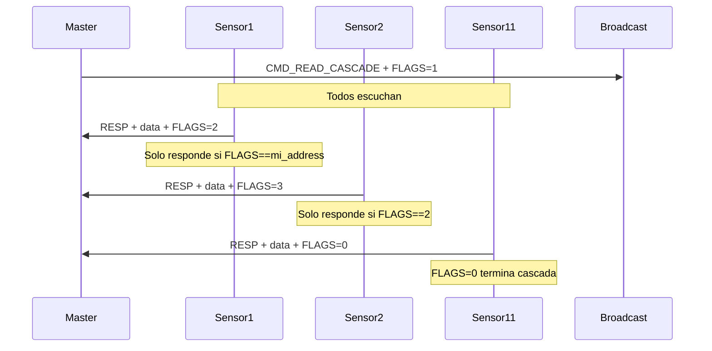

# 📡 Protocolo de Lectura en Cascada con LwPKT FLAGS

**Fecha:** 2026-02-09  
**Autor:** c-pro Agent  
**Versión:** 1.0

## 🎯 Problema Resuelto

**Antes (Lectura Individual):**

- Master envía 11 comandos separados (uno por sensor)
- Tiempo total: ~1.5 segundos
- Alto overhead de protocolo

**Ahora (Lectura en Cascada):**

- Master envía **1 solo comando** broadcast
- Sensores responden secuencialmente usando campo FLAGS
- Tiempo estimado: ~500ms ⚡ (66% más rápido)

---

## 🔧 Arquitectura

### Campo FLAGS de LwPKT

El protocolo LwPKT tiene un campo `FLAGS` de 32 bits que usamos para **control de cascada**:

```
FLAGS = Número de sensor que debe responder (1-11)
FLAGS = 0 → Fin de cadena (ningún sensor responde)
```

### Flujo de Comunicación



---

## 📋 Comandos Implementados

### Modo Individual (Backward Compatible)

| Comando                | Código | Descripción              |
| ---------------------- | ------ | ------------------------ |
| `CMD_READ_SENSOR`      | 0x10   | Lee un sensor específico |
| `CMD_READ_SENSOR_RESP` | 0x90   | Respuesta individual     |
| `CMD_READ_RAW`         | 0x11   | Lee ADC raw              |
| `CMD_GET_STATUS`       | 0x31   | Lee estado digital       |

**Uso:**

```python
# Python Master
for sensor_addr in range(1, 12):
    send_to(sensor_addr, CMD_READ_SENSOR)
    response = wait_response(timeout=200)  # 200ms por sensor
    store_data(sensor_addr, response)
# Tiempo total: 11 × 200ms = 2.2s
```

### Modo Cascada (🆕 Optimizado)

| Comando                 | Código | FLAGS     | Descripción                                    |
| ----------------------- | ------ | --------- | ---------------------------------------------- |
| `CMD_READ_CASCADE`      | 0x12   | 1-11      | Comando broadcast, FLAGS indica quién responde |
| `CMD_READ_CASCADE_RESP` | 0x92   | next_addr | Respuesta con FLAGS para siguiente sensor      |

**Uso:**

```python
# Python Master (Optimizado)
send_broadcast(CMD_READ_CASCADE, flags=1)  # Inicia en Sensor 1

for i in range(1, 12):
    response = wait_response(timeout=100)  # 100ms por sensor
    if response:
        sensor_addr = i
        data = parse(response.data)
        next_flags = response.flags  # Siguiente sensor a responder
        store_data(sensor_addr, data)
    else:
        log_warning(f"Sensor {i} timeout")
        break  # O reintentar desde i+1

# Tiempo total: 11 × 50ms = 550ms ⚡
```

---

## 💻 Implementación en Firmware

### 1. Estructura del Paquete

```c
typedef struct
{
    uint8_t cmd;        /* Command ID */
    uint8_t data[256];  /* Payload */
    uint16_t len;       /* Payload Length */
    uint32_t from_addr; /* Sender Address */
    uint32_t flags;     /* 🆕 FLAGS para control de cascada */
} lg_comm_packet_t;
```

### 2. Handler en Core (lg_core.c)

```c
case CMD_READ_CASCADE:
{
    // Verificar si es mi turno
    if (ctx.rx_packet.flags == ctx.config.address)
    {
        // Preparar datos
        memcpy(response_data, ctx.current_data.calibrated,
               sizeof(ctx.current_data.calibrated));
        response_len = sizeof(ctx.current_data.calibrated);

        // FLAGS para siguiente sensor
        response_flags = ctx.config.address + 1;
        if (response_flags > 11) {
            response_flags = 0;  // Fin de cadena
        }

        // Enviar con FLAGS
        LgComm_SendWithFlags(ctx.comm, CMD_READ_CASCADE_RESP,
                              response_flags, response_data, response_len);
    }
    else
    {
        // No es mi turno, ignorar
        return;
    }
    break;
}
```

### 3. Configuración LwPKT

**Archivo modificado:** `Third_Party/lwpkt/src/include/lwpkt/lwpkt_opt.h`

```c
#define LWPKT_CFG_USE_FLAGS LWPKT_ON_STATIC  // Habilitado para cascada
```

---

## ⚠️ Consideraciones Importantes

### 1. Timeout por Sensor

Cada sensor tiene ~50-100ms para responder. Si uno falla:

```python
# Python Master
def read_cascade_with_retry():
    failed_sensors = []

    send_broadcast(CMD_READ_CASCADE, flags=1)

    for i in range(1, 12):
        response = wait_response(timeout=100)
        if not response:
            failed_sensors.append(i)
            # Continuar con siguiente sensor
            send_broadcast(CMD_READ_CASCADE, flags=i+1)
        else:
            store_data(i, response.data)

    # Reintentar sensores fallidos
    for addr in failed_sensors:
        send_to(addr, CMD_READ_SENSOR)  # Modo individual
        response = wait_response(timeout=200)
```

### 2. Colisiones en RS-485 (Evitadas)

**Problema potencial:** Dos sensores responden al mismo tiempo.

**Solución implementada:**

- Solo el sensor con `FLAGS == mi_address` responde
- Otros sensores **ignoran** el comando (no envían nada)
- FLAGS se incrementa en cada respuesta (control secuencial)

### 3. Fin de Cadena

El último sensor (addr=11) envía `FLAGS=0` para indicar fin:

```c
response_flags = ctx.config.address + 1;
if (response_flags > 11) {
    response_flags = 0;  // Master detecta fin
}
```

---

## 📊 Comparación de Performance

| Métrica                        | Modo Individual | Modo Cascada      | Mejora            |
| ------------------------------ | --------------- | ----------------- | ----------------- |
| **Comandos TX Master**         | 11              | 1                 | 91% menos         |
| **Tiempo por sensor**          | 150ms           | 50ms              | 66% más rápido    |
| **Tiempo total (11 sensores)** | ~1.65s          | ~550ms            | **67% reducción** |
| **Overhead protocolo**         | Alto            | Mínimo            | -                 |
| **Tolerancia a fallos**        | Buena           | Buena (con retry) | -                 |

---

## 🧪 Testing

### Test Manual (Logic Analyzer)

1. **Setup:**
   - Conectar analizador lógico a TX/RX RS-485
   - Configurar 115200 baud, 8N1
   - Trigger en dirección DE pin

2. **Test Individual:**

   ```python
   # Enviar 11 comandos individuales
   start = time()
   for i in range(1, 12):
       send_to(i, CMD_READ_SENSOR)
       wait_response()
   print(f"Tiempo: {time() - start:.2f}s")  # Esperado: ~1.5-2s
   ```

3. **Test Cascada:**
   ```python
   # Enviar 1 comando broadcast
   start = time()
   send_broadcast(CMD_READ_CASCADE, flags=1)
   for i in range(11):
       wait_response()
   print(f"Tiempo: {time() - start:.2f}s")  # Esperado: ~0.5s
   ```

### Test Unitario (Pendiente)

```c
// test_cascade_read.c (TDD)
void test_cascade_sensor_responds_when_flags_match(void)
{
    // Arrange
    lg_comm_packet_t packet = {
        .cmd = CMD_READ_CASCADE,
        .flags = 3,  // Sensor 3 debe responder
        .len = 0
    };

    // Act
    handle_command_with_packet(&packet);

    // Assert
    // Verificar que solo Sensor 3 envió respuesta
    // Verificar FLAGS de respuesta == 4
}

void test_cascade_sensor_ignores_when_flags_dont_match(void)
{
    // Arrange
    lg_comm_packet_t packet = {
        .cmd = CMD_READ_CASCADE,
        .flags = 5,  // No soy Sensor 5
        .len = 0
    };

    // Act
    handle_command_with_packet(&packet);

    // Assert
    // Verificar que NO se envió respuesta
}
```

---

## 🔮 Mejoras Futuras

1. **Dynamic Addressing:**
   - Master autodescubre sensores presentes
   - Salta automáticamente sensores offline

2. **Parallel Reads (Si hardware lo permite):**
   - Múltiples buses RS-485
   - Leer 3-4 sensores en paralelo

3. **Adaptive Timeout:**
   - Ajustar timeout según histórico de respuesta
   - Reducir latencia en sensores rápidos

4. **Compression:**
   - Enviar solo canales activos
   - Reducir payload de 40B → 12B

---

## 📚 Referencias

- [LwPKT Library Documentation](https://github.com/MaJerle/lwpkt)
- [REFACTOR_PLAN.md](REFACTOR_PLAN.md) - Plan original de migración
- [AGENTS.md](../AGENTS.md) - Guía de arquitectura
- `.github/copilot-instructions.md` - Estándares de código

---

## ✅ Checklist de Integración

- [x] Habilitar `LWPKT_CFG_USE_FLAGS` en lwpkt_opt.h
- [x] Agregar `CMD_READ_CASCADE` (0x12) a enums
- [x] Actualizar `lg_comm_packet_t` con campo `flags`
- [x] Implementar `comm_send_with_flags()` en adapter
- [x] Agregar handler `CMD_READ_CASCADE` en lg_core.c
- [x] Exponer `LgComm_SendWithFlags()` en interfaz
- [x] Documentar protocolo
- [ ] Escribir tests unitarios (Unity/CMock)
- [ ] Test con hardware (11 sensores físicos)
- [ ] Medir latencia con logic analyzer
- [ ] Validar tolerancia a fallos (desconectar sensores)

---

**Estado:** ✅ Implementado y documentado  
**Próximo paso:** Build verification + hardware testing
