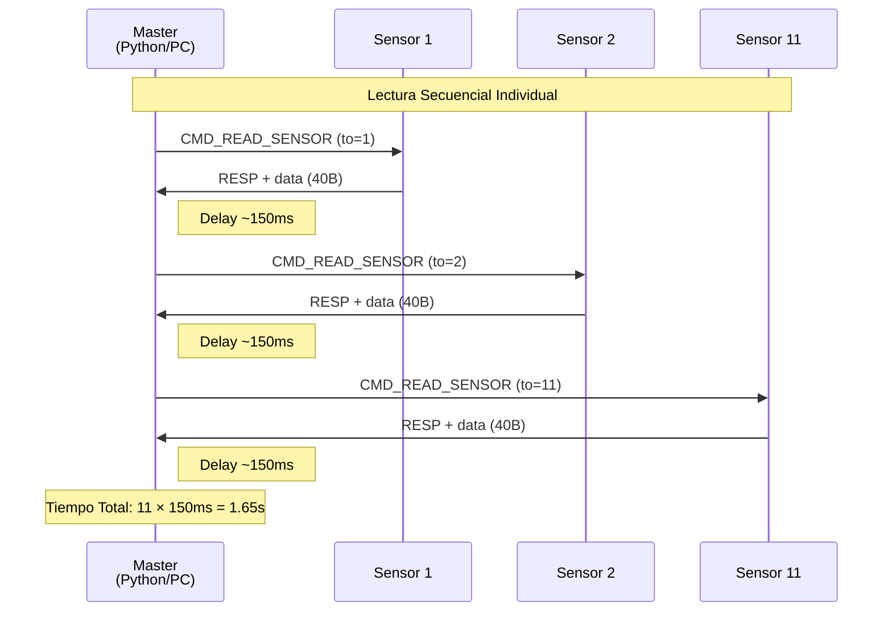
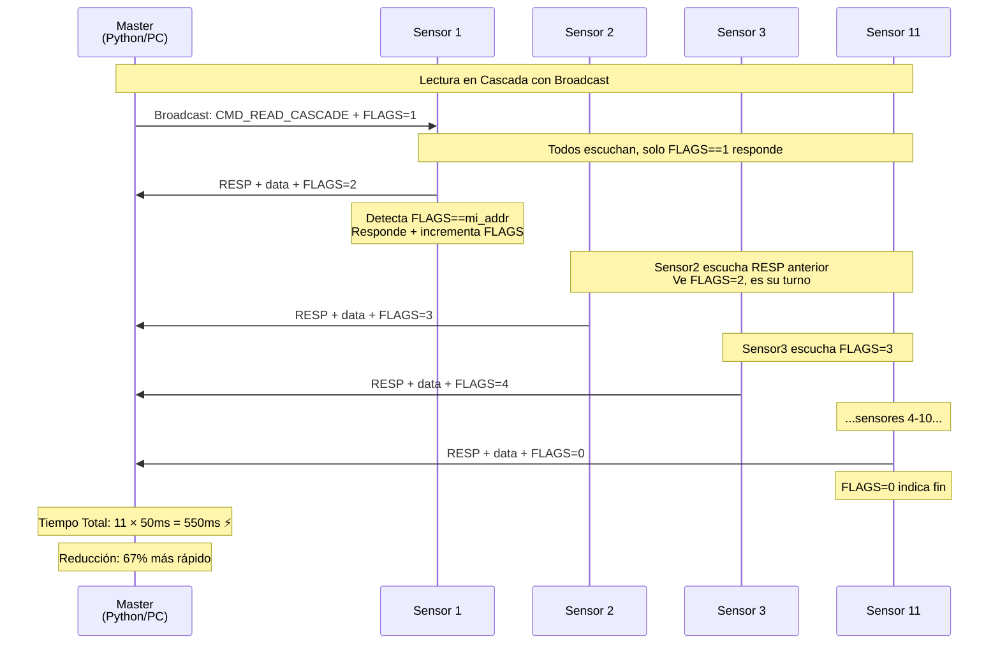
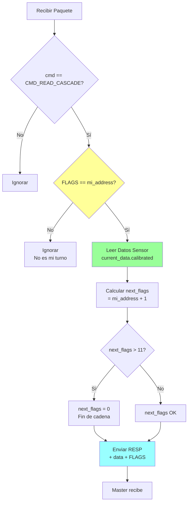
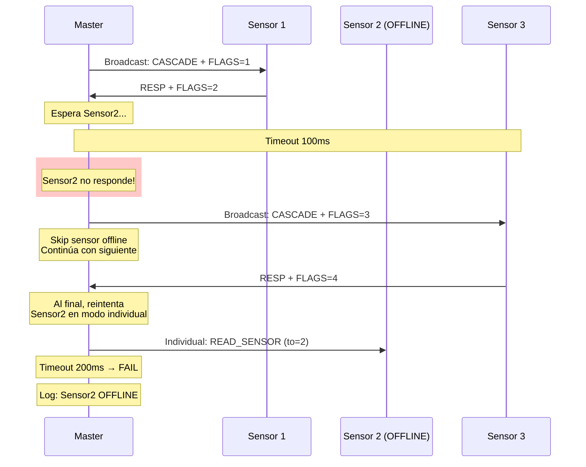
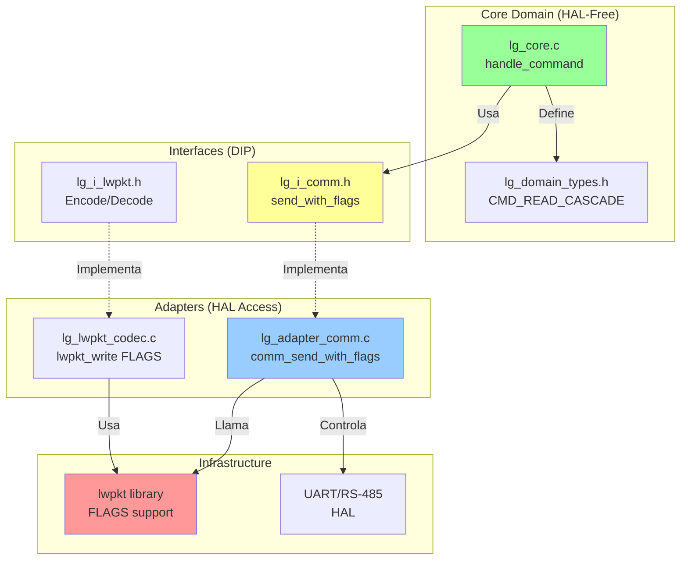

# Diagramas de Secuencia - Lectura Individual vs Cascada

## Modo Individual (Original)

## Modo Cascada (Optimizado con FLAGS)

## Flujo de Decisión en Sensor (CMD_READ_CASCADE)

## Manejo de Errores - Timeout en Cascada

## Arquitectura de Capas (Clean Architecture)

## Comparación de Tráfico en Bus RS-485

```mermaid
gantt
    title Tráfico RS-485: Individual vs Cascada
    dateFormat X
    axisFormat %L ms

    section Individual
    Master→S1     :0, 50
    S1→Master     :50, 100
    Delay         :100, 150
    Master→S2     :150, 200
    S2→Master     :200, 250
    Delay         :250, 300
    Master→S3     :300, 350
    (x11 total)   :350, 1650

    section Cascada
    Master→Broadcast :0, 50
    S1→Master        :50, 100
    S2→Master        :100, 150
    S3→Master        :150, 200
    S4→Master        :200, 250
    S11→Master       :500, 550
```

---

**Leyenda:**

- 🟢 Verde: Capa de dominio (puro C, sin HAL)
- 🟡 Amarillo: Interfaces (abstracciones DIP)
- 🔵 Azul: Adapters (implementaciones concretas)
- 🔴 Rojo: Infraestructura (librerías externas)
